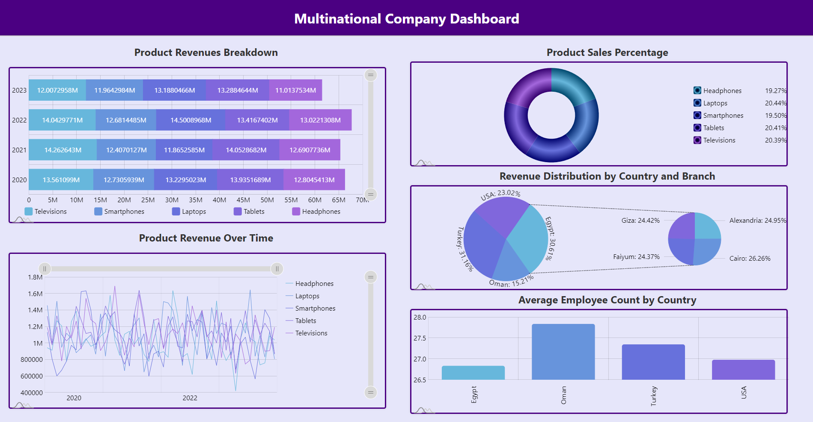
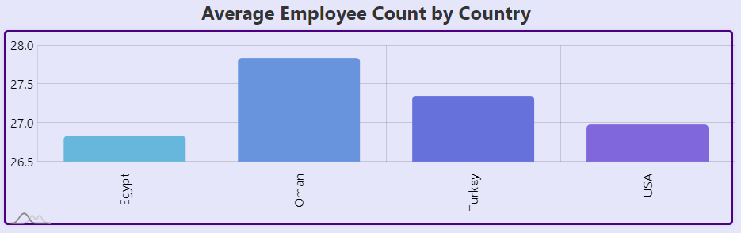
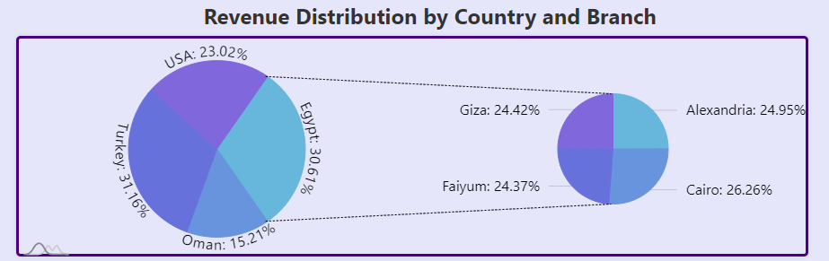
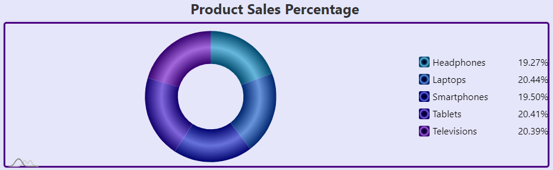
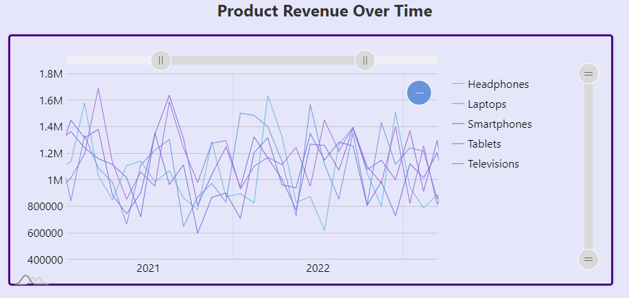
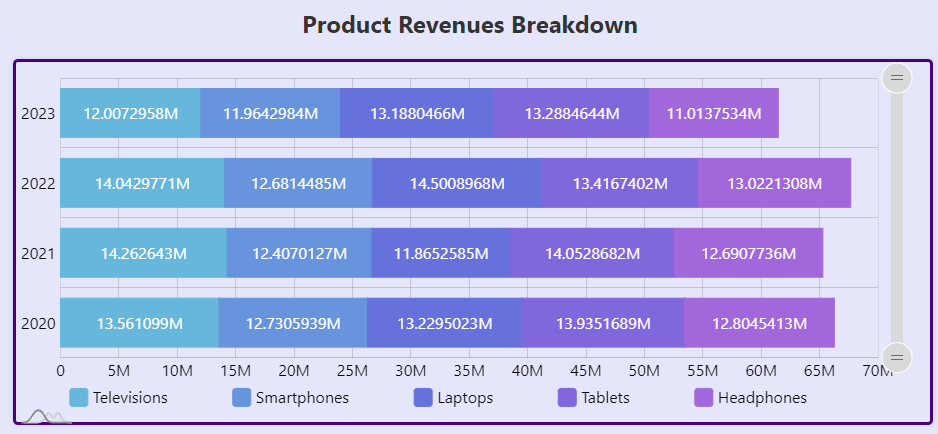

# First_Dashboard
This dashboard provides comprehensive insights into the performance and key metrics of a multinational company with multiple branches.

# DSAI 203 Final Project
# **Multinational Company Dashboard**

# Client: 
The CEO of an electronic devices multinational company

# **Available Information Provided by Client:**
**1) Branches:**  
Egypt: Cairo, Giza, Alexandria, Faiyum  
Turkey: Istanbul, Bursa, Ankara, Antalya  
Oman: Muscat, Sohar  
USA: Austin, New York, Chicago  
**2) Products:**  
Televisions, Smartphones, Laptops, Tablets, Headphones  
**3) Data Description:**  
**Columns:** Year, Month, Country, Branch, Product,
SalesQuantity, Revenue, EmployeeCount, ProductPrice.  
**Time Range:** 2020 to 2023.   
**Note:** Data was randomly generated 

# **Questions Dashboard Answer**:
1) What is the average employee count across different countries?
2) What is the overall sales performance of the company over the years?
3) How has the sales revenue for each product changed over time?
4) How do different branches compare in terms of sales and revenue?
5) What is the distribution of revenue across countries and branches?
6) What is the sales count percentage for each product?
7) Which products contribute the most to the overall revenue?
8) How has the sales quantity and revenue for each product changed over time?

# 1- Employee Avg Count by Country - Bar Chart:
  
**Axis Titles:**  
X-axis (Country)  
Y-axis (Average Employee Count)  
**Legend:** Country Names  
**Questions Answered:** 1  
**Colors:** amcharts5 default colors  

# 2- Country and Branch Revenue - Exploding Pie Chart:
  
**Legend:** Country and Branch Names   
When clicking on the country the pie rotates and the smaller pie changes the branches to the clicked country branches.  
**Questions Answered:** 5  
**Colors:** amcharts5 default colors  

# 3- Sales Count Percentage - Donut Chart:
  
**Legend:** Product Names  
**Questions Answered:** 6, 7  
**Colors:** amcharts5 default colors  

# 4- Product Revenue - Line Graph
  
**Axis:**  
X-axis (Year-Month)  
Y-axis (Revenue)  
**Legend:** Products when pointing on a certain product its line only appears
and the rest become gray, also pointing on a specific point on a line gets an
exact for revenue value at this point. There are 2 sliders horizontally you
can select a specific time range or move vertically along the values.  
**Questions Answered:** 3, 8  
**Colors:** amcharts5 default colors  

# 5- Product Revenue Breakdown - Stacked Bar Chart
  
**Axis:**  
X-axis (Revenue)  
Y-axis (Year)  
**Legend:** Products and you can hide a category by clicking on the  
square beside the product name.
**Questions Answered:** 2, 4  
**Colors:** amcharts5 default colors  

# **Positioning**
**Left Half:**
1. Stacked Bar Chart (Product Revenue Breakdown): Positioned at the top for a quick overview of product revenue breakdown.

2. Line Chart (Product Revenue Over Time): Positioned below the stacked bar chart to show revenue trends over time.

**Right Half:**
1. Donut Chart (Sales Count Percentage): Positioned at the top for a quick view of sales count distribution.

2. Exploding Pie Chart (Revenue Distribution by Country and Branch): Positioned in the middle to highlight distribution across countries and branches.

3. Bar Chart (Average Employee Count by Country): Positioned at the bottom to show average employee count across different countries.

# **Future Work**
- Dynamic Data Integration
- Responsive Design
- Dashboard Theming by users

# **How to Run**
- Run $ py server.py
- Open http://127.0.0.1:5000
